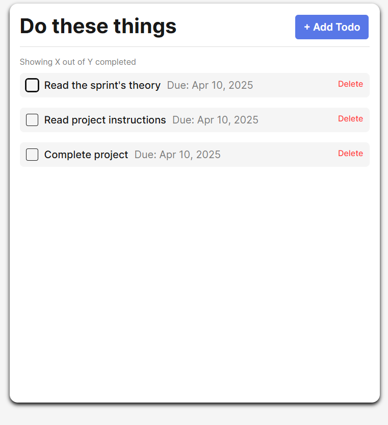
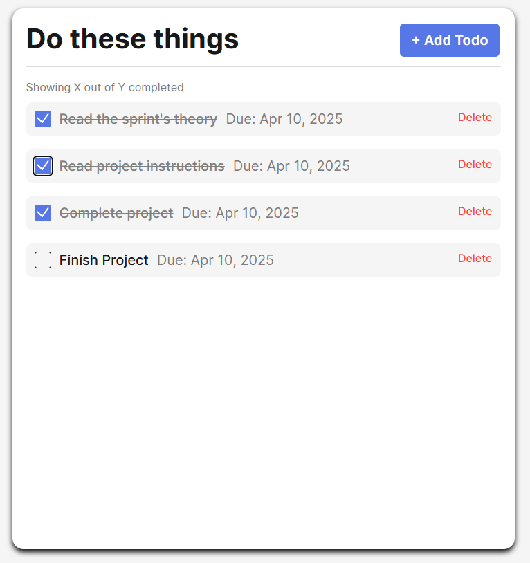

# TaskFlow

Super Hi-Tech Todo App

Project Description

The Todo App is a responsive and user-friendly web application designed to help users manage their tasks effectively. Users can add new tasks, mark them as complete, and delete tasks when no longer needed. The app aims to provide a straightforward task management experience for everyday use.

## Functionality

-Add tasks with a title and optional due date.
-Mark tasks as completed by toggling a checkbox, visually indicating completion with a strikethrough effect applied to the task item.
-Remove tasks using a delete button.
-Validation ensures that task inputs meet the required standards.
-User-friendly and intuitive interface.

## Technology

Technologies include:
HTML5: To structure the web page.
CSS: To style the application and ensure responsiveness.
JavaScript (ES6): To manage dynamic interactivity and functionality.

Techniques include:
Responsive Design: Ensures the application looks great on all screen sizes.
Object-Oriented Programming (OOP): Encapsulation of functionality within classes like Todo and FormValidator.
DOM Manipulation: Dynamically creating, updating, and removing elements based on user interaction.
Form Validation: Validation logic to ensure user inputs meet requirements.
Event Handling: Adding event listeners to enable interactive features.
Version Control: Managed using Git/GitHub to track changes and collaborate effectively.

## Project Link

Check out the project on GitHub: [Todo App Repository](https://github.com/tylub001/se_project_todo-app#)

